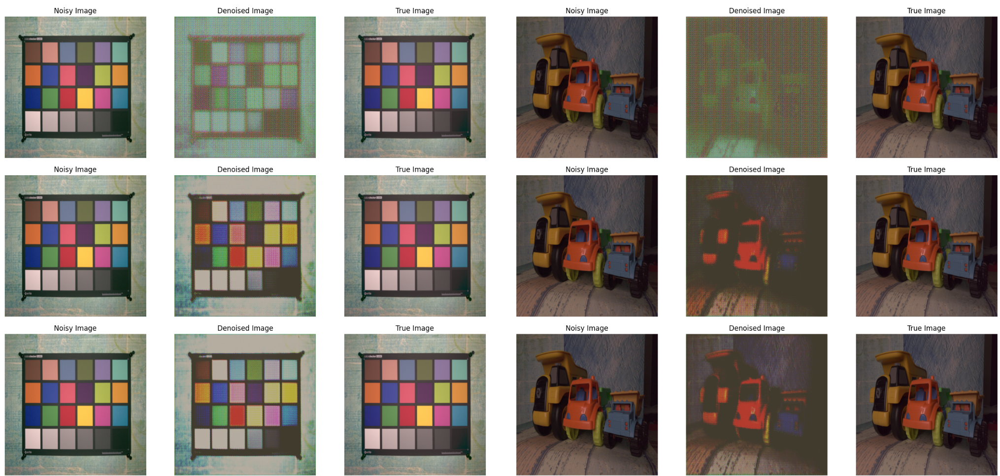
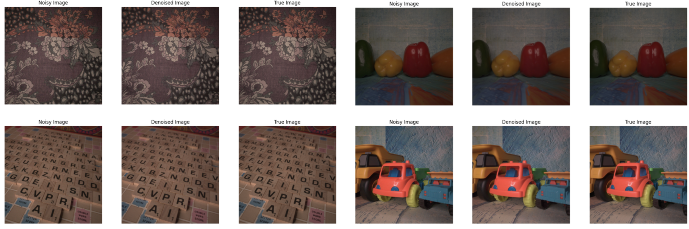

# Exploring Generative Adversarial Networks for Image Denoising

## Introduction
This project investigates the application of Generative Adversarial Networks (GANs) for the task of image denoising. 

## Data
We leverage two primary datasets for training and evaluation:

- [**Smartphone Image Denoising Dataset (SIDD)**](https://abdokamel.github.io/sidd/): Contains 160 unique image scenes in various noise versions, originally in high resolution and downsampled to 512x512 for this project.
- [**BLUR Dataset**](https://www.kaggle.com/datasets/kwentar/blur-dataset): A collection from Kaggle featuring blurred images alongside their sharp counterparts, aimed at testing the model's ability to restore clarity.

## Models
Our approach includes both a custom GAN model built with PyTorch and an implementation utilizing the FastAI library. 

- **Custom GAN**: Developed using PyTorch, comprises a generator and discriminator designed specifically for the denoising task.
- **FastAI GAN**: Leveraging the FastAI library's tools and pre-built architectures, we crafted a U-Net model with a ResNet34 backbone for effective image denoising.

## Training
The training process involves adversarial training of the generator and discriminator, optimizing them to produce denoised images that are as close as possible to their original, noise-free versions. 

## Results
Our experiments reveal that while the custom GAN showed potential, the FastAI implementation yielded more effective denoising results.

## Results

### Custom GAN - SIDD Dataset

| Metric        | Input Image | Denoised Image |
|---------------|-------------|----------------|
| Average PSNR  | 39.09       | 28.36          |
| Average SSIM  | 0.9296      | 0.5036         |

### FastAI GAN - SIDD Dataset

| Metric        | Input Image | Denoised Image |
|---------------|-------------|----------------|
| Average PSNR  | 38.66       | 37.21          |
| Average SSIM  | 0.9136      | 0.9443         |

### PyTorch GAN Visualization

### FastAI GAN Visualization

## Conclusion
The project demonstrates the feasibility of using GANs for image denoising, with significant success achieved using the FastAI framework. The exploration opens up further avenues for research, particularly in areas like image super-resolution and the use of more advanced GAN architectures for image restoration tasks.

## How to Use
Training and Evaluation was done through Kaggle and Google Colab. The corresponding notebooks represent each implementation method.

## Acknowledgments
Conducted as part of the AIPI 590 - Computer Vision course at Duke University tought by Xu Chen.